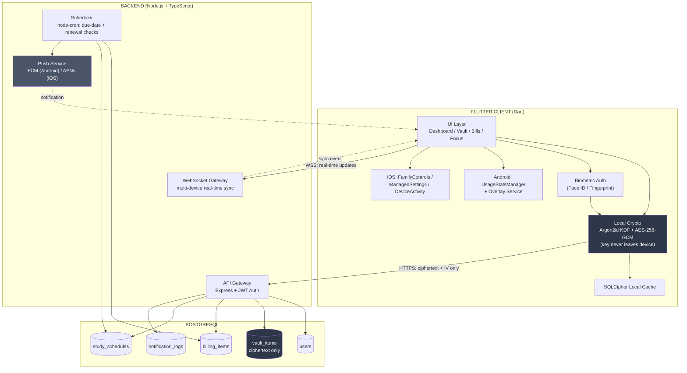
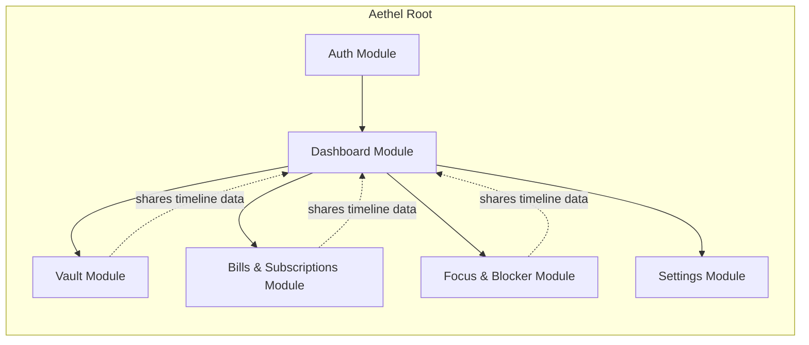
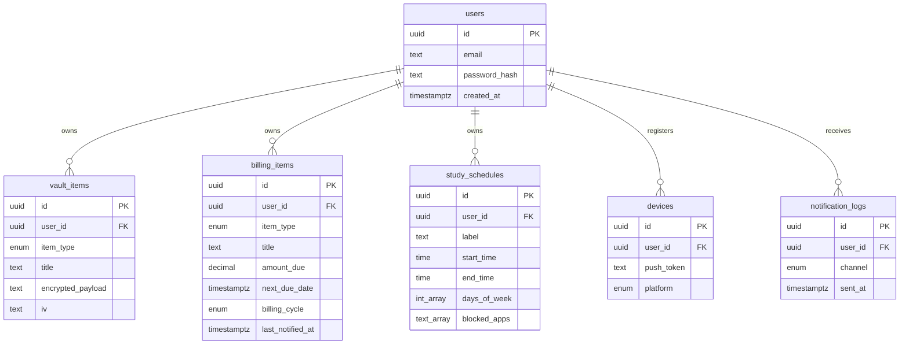

# App.md — Full Technical & Design Specification
**Official Name: Aethel**
*Last updated: September 18, 2026*

---

## 1. Core Concept

**One sentence:** A single mobile app that removes the "I have to remember this myself" burden of daily life by combining a zero-knowledge password vault, a bill/subscription/renewal tracker, and an optional app-blocking focus mode — unified into one chronological timeline instead of three separate apps.

**The core insight (your differentiator):** Existing tools each solve *one* category (1Password solves credentials, Rocket Money solves subscriptions, Opal solves focus) but none of them connect the categories. The value isn't just consolidation — it's **contextual execution**: a study-block reminder can surface the exact login the user needs for that session, right next to the lock controls, instead of forcing three app switches.

**What the app is not:** Not a bank-sync-first finance app, not a parental-control app, not a generic to-do list. Scope discipline matters here — see §11 for why blocking is deliberately Phase 3, not Phase 1.

---

## 2. System Architecture



**Trust boundary — the one rule that governs everything else:** anything sensitive (passwords, secure notes) is encrypted *on the device, before* it touches the network. The backend, the database, and anyone who breaches either only ever sees ciphertext. Titles/labels (e.g. "Netflix," "Electricity Bill") stay in plaintext since they aren't secret and need to be searchable/sortable server-side.

---

## 3. Raw App Skeleton (module-level view)



Every feature module is self-contained (own screens, own state, own API calls) but publishes events to a shared **Timeline Provider** that the Dashboard reads from — this is what makes the "unified timeline" possible without tightly coupling the modules together.

---

## 4. Frontend Documentation (Flutter / Dart)

### 4.1 Folder structure
```
lib/
├── main.dart
├── app.dart
├── core/
│   ├── constants/            # colors.dart, spacing.dart, strings.dart
│   ├── theme/                 # app_theme.dart, text_styles.dart
│   ├── crypto/
│   │   ├── kdf_service.dart
│   │   ├── aes_service.dart
│   │   └── secure_key_store.dart
│   ├── network/
│   │   ├── api_client.dart
│   │   └── websocket_client.dart
│   └── utils/
├── data/
│   ├── local/{db, daos}/
│   ├── remote/{auth_api, vault_api, bills_api, schedules_api}.dart
│   └── repositories/
├── domain/{models, usecases}/
├── features/
│   ├── dashboard/{presentation, providers}/
│   ├── vault/{presentation, providers}/
│   ├── bills_subscriptions/{presentation, providers}/
│   ├── focus_blocker/{presentation, providers}/
│   ├── auth/{presentation, providers}/
│   └── settings/{presentation, providers}/
├── platform/
│   ├── android/usage_stats_channel.dart
│   └── ios/screen_time_channel.dart
└── widgets/                   # timeline_tile.dart, urgency_card.dart, app_fab.dart
```

### 4.2 State management
**Riverpod**, chosen over Provider/Bloc for Aethel because:
- No BuildContext dependency for reading state (useful across the many biometric-gated screens)
- Easy to test the crypto/vault logic in isolation from widgets
- `AsyncNotifierProvider` maps cleanly onto "load from local cache instantly, then reconcile with server" pattern this app needs everywhere

### 4.3 Key packages
| Package | Purpose |
|---|---|
| `flutter_riverpod` | State management |
| `dio` | HTTP client, JWT refresh interceptor |
| `sqflite_sqlcipher` | Encrypted local cache |
| `flutter_secure_storage` | Keychain/Keystore for vault key |
| `local_auth` | Biometric unlock |
| `cryptography` | Argon2id + AES-256-GCM |
| `firebase_messaging` | Push notifications |
| `web_socket_channel` | Real-time multi-device sync |
| `table_calendar` | Weekly schedule picker UI |

### 4.4 Screens
1. Splash / biometric unlock
2. Onboarding + master password setup
3. Dashboard (unified timeline)
4. Vault grid
5. Vault item detail (biometric re-auth to reveal)
6. Add/Edit vault item
7. Bills & Subscriptions list
8. Add/Edit bill/subscription
9. Focus & App Blocker panel
10. Schedule editor
11. Settings

---

## 5. Backend Documentation (Node.js + TypeScript + Express)

### 5.1 Folder structure
```
src/
├── server.ts
├── app.ts
├── config/{env.ts, db.ts}
├── middleware/{auth, rateLimiter, errorHandler}.middleware.ts
├── modules/
│   ├── auth/{controller, service, routes}.ts
│   ├── vault/{controller, service, routes}.ts
│   ├── billing/{controller, service, routes}.ts
│   ├── schedules/{controller, service, routes}.ts
│   └── notifications/{service, routes}.ts
├── jobs/
│   ├── scheduler.ts
│   ├── dueDateCheck.job.ts
│   └── priceChangeCheck.job.ts
├── websocket/syncGateway.ts
└── prisma/schema.prisma
```

### 5.2 API surface
```
Auth
POST   /auth/signup
POST   /auth/login
POST   /auth/refresh
POST   /auth/logout

Vault (ciphertext in/out only)
GET    /vault/items
POST   /vault/items
PATCH  /vault/items/:id
DELETE /vault/items/:id

Billing (bills + subscriptions)
GET    /billing/items
POST   /billing/items
PATCH  /billing/items/:id
DELETE /billing/items/:id

Schedules
GET    /schedules
POST   /schedules
PATCH  /schedules/:id
DELETE /schedules/:id

Devices & Sync
POST   /devices/register
WS     /sync
```

### 5.3 Background jobs
- `dueDateCheck.job.ts` runs every 5–15 minutes, queries `billing_items` and `study_schedules` for anything entering the notification window, dispatches via `notifications.service.ts`, and stamps `last_notified_at` to prevent duplicate sends.

### 5.4 Security middleware
- Short-lived JWT access tokens (~15 min) + rotated refresh tokens
- Rate limiting on all `/auth/*` routes
- Schema validation (zod) on every controller input — vault/billing endpoints explicitly reject anything that isn't shaped like ciphertext, as a second line of defense against accidentally logging plaintext

---

## 6. Database Documentation (PostgreSQL)



**Critical design rule:** `password_hash` (on `users`) authenticates login only. It must never be usable to derive the vault encryption key — that key is computed and stays entirely on-device (see §8.4).

---

## 7. Screen Sketches (wireframes, text-based for this doc)

### Dashboard
```
┌──────────────────────────────────┐
│  Good evening               ⚙️    │
│  ┌───────────┐  ┌───────────┐    │
│  │ 4 Active  │  │ ₹3,200    │    │
│  │ Subs      │  │ due wk    │    │
│  └───────────┘  └───────────┘    │
│                                    │
│  🔴 Today 4:00 PM                 │
│  ⚠️ Electricity Bill — ₹1,450     │
│  ──────────────────────────       │
│  🔵 Tomorrow 10:00 AM             │
│  🔒 Deep Work Lock Scheduled      │
│  ──────────────────────────       │
│  🟡 Friday                        │
│  🔄 Netflix Renews — ₹649         │
│                                    │
│              ➕ (FAB)              │
└──────────────────────────────────┘
```

### Vault Grid
```
┌──────────────────────────────────┐
│ [ All ] [ Passwords ] [ Notes ]   │
│ ┌──────────────────────────────┐ │
│ │ 🔷 Gmail                      │ │
│ │ user****@gmail.com   [Copy]   │ │
│ └──────────────────────────────┘ │
│ ┌──────────────────────────────┐ │
│ │ 🔶 Netflix                    │ │
│ │ ****@domain.com      [Copy]   │ │
│ └──────────────────────────────┘ │
│   tap card → 🔐 Face ID → reveal  │
└──────────────────────────────────┘
```

### Focus & App Blocker
```
┌──────────────────────────────────┐
│        ⏱ 01:24:36 remaining       │
│      "Exam Prep" session active   │
│                                    │
│  Blocked apps:                    │
│  [x] Instagram    [x] TikTok      │
│  [ ] Slack        [x] YouTube     │
│                                    │
│  Weekly rule: Mon/Wed/Fri 2–4PM   │
│                                    │
│         [ Edit Schedule ]         │
└──────────────────────────────────┘
```

### Bills & Subscriptions
```
┌──────────────────────────────────┐
│ This week                         │
│ ┌──────────────────────────────┐ │
│ │ ⚡ Electricity   ₹1,450  4 PM  │ │
│ │        [Mark Paid]            │ │
│ └──────────────────────────────┘ │
│ This month                        │
│ ┌──────────────────────────────┐ │
│ │ 🎬 Netflix       ₹649   Fri   │ │
│ │        [Cancel] [Snooze]      │ │
│ └──────────────────────────────┘ │
└──────────────────────────────────┘
```

---

## 8. UI/UX Theming

### 8.1 Principles
- Calm authority over clutter — max 3 metric chips on dashboard load, everything else collapsed behind taps
- Consistent urgency color language across every screen: **red = overdue**, **yellow = within 7 days**, **blue = scheduled/informational**, **green = resolved**
- One primary action per screen — the focus-lock toggle never visually competes with the bill timeline for attention

### 8.2 Color tokens (starting point)
| Token | Light | Dark |
|---|---|---|
| `bg.primary` | `#FAFAF9` | `#121316` |
| `bg.surface` | `#FFFFFF` | `#1C1E22` |
| `text.primary` | `#1A1A1E` | `#F2F2F3` |
| `accent` | `#3B6E6B` (muted teal) | `#5FA39F` |
| `urgent` | `#D64545` | `#E06767` |
| `upcoming` | `#D9A441` | `#E0B65C` |
| `informational` | `#3F6FBF` | `#6C93D6` |
| `resolved` | `#4C9A6A` | `#6FBF8A` |

Deliberately avoiding generic security clichés — Aethel reads closer to a premium, high-end productivity system.

### 8.3 Typography
- Headers: system sans-serif stack (Inter / SF Pro / Roboto depending on platform) — avoids font licensing and load overhead
- Body: same family, regular weight, minimum 15sp for readability in low-light "checking bills at night" use case
- Dark mode is first-class, not a toggle afterthought

### 8.4 Security-driven UX rules
- Any full password/secret reveal requires biometric re-auth **every time**, not just once per app session
- Copy-to-clipboard auto-clears after 30–60 seconds
- Plain-language permission explanations before requesting Screen Time / Accessibility-adjacent permissions

---

## 9. Tech Stack

| Layer | Choice |
|---|---|
| Frontend | Flutter (Dart) |
| State management | Riverpod |
| Local storage | SQLCipher (SQLite + encryption) |
| Backend | Node.js + TypeScript + Express |
| ORM | Prisma |
| Database | PostgreSQL |
| Scheduler | node-cron |
| Push | Firebase Cloud Messaging (Android) + APNs (iOS) |
| Real-time sync | WebSocket (native `ws` or Socket.IO) |
| Crypto | Argon2id (KDF) + AES-256-GCM (payload encryption) |

---

## 10. Functions & Functionalities

### 10.1 Auth module
- `signUp(email, password)` — creates account, derives login credential separately from vault key
- `logIn(email, password)` — returns access + refresh JWT
- `refreshToken(refreshToken)` — rotates and returns new access token
- `enableBiometric()` / `verifyBiometric()` — gates vault reveal and app unlock
- `logOut()` — revokes refresh token server-side, clears local session

### 10.2 Vault module
- `deriveVaultKey(masterPassword, deviceSalt)` — Argon2id, on-device only, never transmitted
- `addVaultItem(title, payload, type)` — encrypts locally, syncs ciphertext
- `revealVaultItem(itemId)` — requires fresh biometric check, decrypts locally
- `editVaultItem(itemId, newPayload)` — re-encrypts, syncs
- `deleteVaultItem(itemId)`
- `copyToClipboard(value)` — auto-clears after timeout

### 10.3 Bills & Subscriptions module
- `addBillingItem(title, amount, dueDate, cycle, type)`
- `markPaid(itemId)` — advances `next_due_date` per `billing_cycle`
- `cancelSubscription(itemId)` — marks inactive, optionally deep-links to provider's cancel page
- `snoozeReminder(itemId, days)`
- `getMonthlySpendTotal()` — aggregates active subscriptions for dashboard chip

### 10.4 Focus & Blocker module
- `createSchedule(label, startTime, endTime, daysOfWeek, blockedApps)`
- `startImmediateLock(blockedApps, durationMinutes)` — one-tap lock outside a recurring schedule
- `checkForegroundApp()` *(Android)* — polls `UsageStatsManager`, triggers overlay if in `blockedApps`
- `requestFamilyControlsAuthorization()` *(iOS)* — triggers Apple's system consent flow
- `endSession()` — releases the block, logs session length for optional stats

### 10.5 Notifications & sync
- `registerDevice(pushToken, platform)`
- `dueDateCheckJob()` — server cron, runs every 5–15 min
- `sendPushNotification(userId, payload)`
- `broadcastSyncEvent(userId, changeType, entity)` — pushes real-time updates to all of a user's other connected devices over WebSocket

### 10.6 Dashboard/timeline aggregation
- `getUnifiedTimeline(userId, rangeStart, rangeEnd)` — merges billing due dates + schedule start times + any vault-linked reminders into one sorted, color-coded list for the dashboard

---

## 11. Full Plan (roadmap)

### Phase 1 — Foundation (no platform-gated APIs, lowest risk)
- Flutter UI skeleton: Dashboard, Vault, Bills screens
- On-device crypto (Argon2id + AES-256-GCM), SQLCipher cache
- Backend: auth, vault, billing modules + PostgreSQL schema
- Push notifications wired to due-date cron job
- **Milestone:** usable app for passwords + bills/subscriptions, shippable to both stores with no special entitlement risk

### Phase 2 — Real-time sync + polish
- WebSocket multi-device sync
- Settings module: export data, delete account, notification preferences
- UI polish pass against §8 theming rules

### Phase 3 — Focus / App Blocker
- File the iOS `FamilyControls` distribution entitlement request at the start of this phase
- Android: `UsageStatsManager` + overlay implementation
- Schedule editor + immediate-lock UI
- **Milestone:** full three-pillar app, contingent on Apple's approval

### Phase 4 — Growth features
- Bank-linked auto-detection for subscriptions (Plaid-style)
- OCR-based renewal/expiry extraction from uploaded documents
- Gmail/email-scanning digest

---

## 12. Open Decisions for Kickoff

1. **Master password recovery mechanism:** Choose between *No recovery (pure zero-knowledge)* vs. *Printed recovery key* vs. *Trusted-contact recovery*.
2. **Monetization model:** Determine freemium tier boundaries vs. flat subscription pricing model.